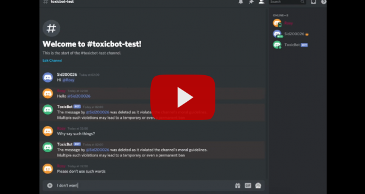

========
ToxicBot
========

**Discord bot for detecting and deleting toxic messages**

..
  Including logo image below as raw HTML since GitHub doesn't seem to support image scaling in RST: https://github.com/github/markup/issues/295

.. raw:: html

  

    
  

.. contents::
   :local:

.. section-numbering::

Introduction
=============

Discussing things you care about can be difficult: the threat of abuse and harassment online means that many people stop expressing themselves and give up on seeking different opinions. 

Platforms struggle to effectively facilitate conversations, leading many communities to limit or completely shut down user comments. Toxic or insulting comments are nowhere more evident than the popular platform Discord since it is possible to remain anonymous on Discord. 

We try to develop a discord bot that can remove toxic comments and warn users. It can also provide reports to the guild or server owner about all the members whoose comments have been deleted ( not implemented ).

Disclaimer
==========

**The dataset used for training this bot contains text that may be considered profane, vulgar, or offensive.**

Demo
=====

View a demo of ToxicBot in action on YouTube (click image below):

Installation
============

Prerequisites
---------

- Python 3.6+
- ``pip``
- Discord Developer Account

macOS/Linux
---------

For installing on macOS or Linux, first clone the repository:

.. code-block:: bash

    $ git clone https://github.com/ToxicBot-Discord/ToxicBot.git

Then run ``setup.sh`` in your local ``ToxicBot`` repository:

.. code-block:: bash

    $ cd ToxicBot
    $ bash setup.sh
    
Source the ``activate`` file and launch the ``app.py`` Python script:

.. code-block:: bash
    
    $ source env/bin/activate
    $ python app.py

Windows
-------

For installing on Windows, download and install:

- Python 3.6 (64 Bit Version) from https://www.python.org/ftp/python/3.6.5/python-3.6.5-amd64.exe
- ``git`` for Windows from https://git-scm.com/download/win

Open the "git bash" app

   *Note*: you can right-click on the desktop and choose "git bash here" from the contextual menu

Clone the repository:

.. code-block:: bash

    $ git clone https://github.com/ToxicBot-Discord/ToxicBot.git

Execute these commands in ``git bash``:

.. code-block:: bash

    $ cd ToxicBot
    $ sh setup-win.sh

Paste your Discord token when prompted by the ``setup-win.sh`` script. 

When the installation is done, start the app by executing these commands in ``git bash``:

.. code-block:: bash

    $ cd ToxicBot
    $ . env/Scripts/activate
    $ python app.py

Commands
=============

.. |br| raw:: html

   

Below are the commands that can be used with ToxicBot. Just type the command in the channel's textbox:

+-----------------+---------------+-----------------------------------------------------------------------------------------------------+
| Command         | Accessible By | Description                                                                                         |
+=================+===============+=====================================================================================================+
| ``/report``     | All users     | Displays the link to the ToxicBot GitHub project page to |br| report bugs and issues                |
+-----------------+---------------+-----------------------------------------------------------------------------------------------------+
| ``/info``       | All users     | Displays information about the current running bot                                                  |
+-----------------+---------------+-----------------------------------------------------------------------------------------------------+
| ``/help``       | All users     | Displays the list of available commands                                                             |
+-----------------+---------------+-----------------------------------------------------------------------------------------------------+
| ``/config``     | Server owners | Displays ToxicBot's current configuration settings                                                  |
+-----------------+---------------+-----------------------------------------------------------------------------------------------------+
| ``/setcount N`` | Server owners | Sets the number of toxic comments before suspending user |br| ( ex: ``/setcount 10``)               |
+-----------------+---------------+-----------------------------------------------------------------------------------------------------+
| ``/setdays N``  | Server owners | Sets the number of days before toxic comments count for a |br| user is reset ( ex: ``/setdays 15``) |
+-----------------+---------------+-----------------------------------------------------------------------------------------------------+
| ``/toptoxic N`` | Server owners | Returns the top N toxic comments by user for a server |br| ( ex: ``/toptoxic 5``)                   |
+-----------------+---------------+-----------------------------------------------------------------------------------------------------+

Toxic Comment Classification
============================

Model 1
-------

- **GitHub:** https://github.com/ToxicBot-Discord/Toxic-Comment-Classification
- **Kaggle:** https://www.kaggle.com/c/jigsaw-toxic-comment-classification-challenge/
- **Algorithm:** GloVe Embedding and Recurrent Neural Network ( LSTM )

Model 2
-------

This is model used in ToxicBot.

- **GitHub:** https://github.com/ToxicBot-Discord/Unintended-Bias-in-Toxicity-Classification
- **Kaggle:** https://www.kaggle.com/c/jigsaw-unintended-bias-in-toxicity-classification
- **Algorithm:** GloVe Embedding and Recurrent Neural Network ( LSTM )

Links
=====

- **GitHub:** https://github.com/ToxicBot-Discord/ToxicBot/
- **Discord:** https://discord.com/
